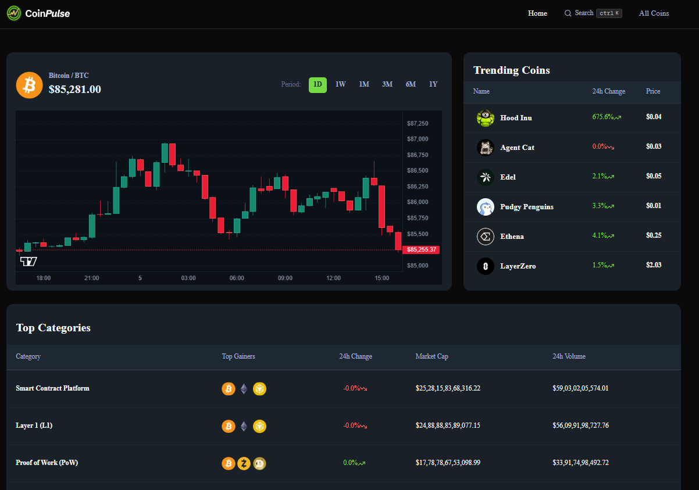
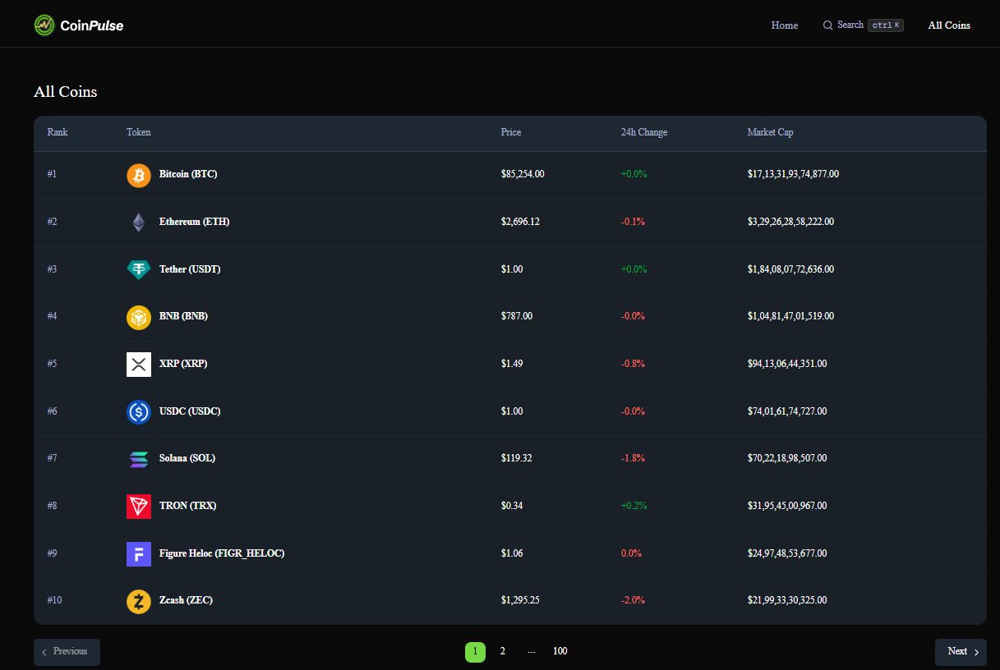
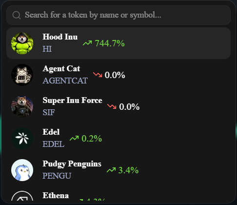
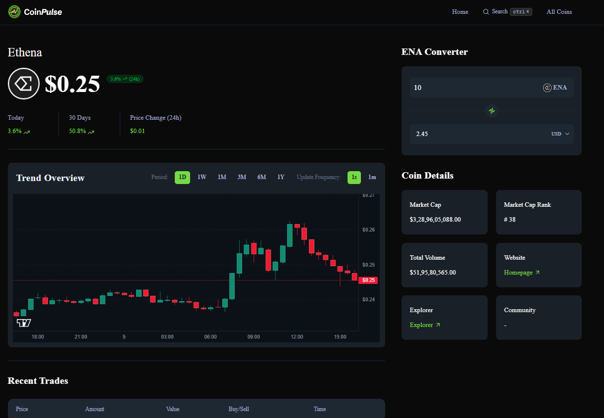

# CoinPulse

> A modern cryptocurrency market tracking platform built with Next.js and TypeScript.

CoinPulse is a responsive crypto market application that allows users to explore cryptocurrency prices, market statistics, search for coins, and view detailed information about individual cryptocurrencies through a clean and intuitive interface.

The project focuses on building a production-style frontend with current cryptocurrency market data, reusable components, API integration, responsive layouts, and a structured Next.js application architecture.

## Features

* Cryptocurrency market overview
* Browse all available cryptocurrencies
* Search cryptocurrencies through an interactive search modal
* Detailed cryptocurrency pages
* Current cryptocurrency prices
* Market capitalization and trading volume
* Price change information
* Responsive design for desktop, tablet, and mobile
* Loading and fallback states
* Reusable React components
* Type-safe development with TypeScript
* Server-side API integration
* Environment-based API configuration

## Technical Highlights

- Built with Next.js App Router and TypeScript
- Implemented server-side cryptocurrency data fetching
- Integrated CoinGecko REST APIs for market data
- Created reusable components for coin cards, tables, search, and market statistics
- Implemented dynamic routes for individual cryptocurrency pages
- Added loading and fallback UI for asynchronous data
- Used environment variables to securely configure API access
- Designed responsive layouts for desktop, tablet, and mobile
  
## Screenshots

### Home

The CoinPulse home page provides an overview of the cryptocurrency market and highlights important market information.



### All Coins

Browse and explore the available cryptocurrencies in one place.



### Search

Search for cryptocurrencies quickly using the interactive search interface.



### Coin Details

View detailed information about an individual cryptocurrency, including its market data and price information.



## Tech Stack

### Frontend

* Next.js
* React
* TypeScript
* Tailwind CSS
* shadcn/ui

### Data & APIs

* CoinGecko API
* REST API integration

### Development Tools

* Git
* GitHub
* ESLint
* VS Code

## Application Architecture

```text
                         CoinPulse
                            │
                            ▼
                     Next.js Application
                            │
             ┌──────────────┴──────────────┐
             │                             │
             ▼                             ▼
       UI Components                  Server Layer
             │                             │
             │                             ▼
             │                       API Integration
             │                             │
             │                             ▼
             │                       CoinGecko API
             │                             │
             └──────────────┬──────────────┘
                            │
                            ▼
                    Cryptocurrency Data
                            │
                            ▼
                    Responsive Interface
```

## Application Flow

```text
User
 │
 ├── Home
 │    └── View market overview
 │
 ├── All Coins
 │    └── Browse cryptocurrencies
 │
 ├── Search
 │    └── Search for a cryptocurrency
 │         └── Select Coin
 │              └── Coin Details
 │
 └── Coin Details
      └── View price and market information
```

## API Integration

CoinPulse uses the CoinGecko API to retrieve cryptocurrency market data.

The application separates API communication from the UI layer, making the data-fetching logic reusable and easier to maintain.

The API layer is responsible for:

* Building API requests
* Passing query parameters
* Handling API responses
* Managing API configuration
* Returning typed data to the application

## Project Structure

```text
CoinPulse/
│
├── app/
│   ├── api/
│   ├── coins/
│   ├── globals.css
│   ├── layout.tsx
│   └── page.tsx
│
├── components/
│   ├── Header
│   ├── Search
│   ├── CoinCard
│   ├── DataTable
│   └── ...
│
├── hooks/
│
├── lib/
│   ├── actions/
│   ├── api/
│   └── utils/
│
├── public/
│   └── screenshots/
│       ├── Home.png
│       ├── AllCoins.png
│       ├── SearchModal.png
│       └── CoinDetail.png
│
├── constants.ts
├── type.d.ts
├── package.json
└── README.md
```

## Getting Started

### Prerequisites

Make sure you have the following installed:

* Node.js 18+
* npm
* Git

### Clone the repository

```bash
git clone https://github.com/shrutikotgire0129/CoinPulse.git
```

### Navigate to the project

```bash
cd CoinPulse
```

### Install dependencies

```bash
npm install
```

### Configure environment variables

Create a `.env.local` file in the root directory:

```env
COINGECKO_BASE_URL=your_coingecko_base_url
COINGECKO_API_KEY=your_coingecko_api_key
```

Do not commit `.env.local` or expose your API key publicly.

### Run the development server

```bash
npm run dev
```

Open the application at:

```text
http://localhost:3000
```

## Available Scripts

```bash
npm run dev
```

Starts the development server.

```bash
npm run build
```

Creates a production build.

```bash
npm run start
```

Starts the production server.

```bash
npm run lint
```

Runs ESLint to check the codebase.

## What I Learned

Building CoinPulse helped me strengthen my understanding of:

* Next.js App Router architecture
* TypeScript in a real-world application
* API integration and server-side data fetching
* Working with third-party APIs
* Managing environment variables
* Designing reusable React components
* Building responsive interfaces with Tailwind CSS
* Handling loading and fallback states
* Structuring a scalable frontend codebase
* Working with cryptocurrency and financial market data

## Future Improvements

Potential improvements for future versions include:

* Interactive historical price charts
* Cryptocurrency watchlists
* User authentication
* Portfolio tracking
* Price alerts
* Cryptocurrency comparison
* Multiple fiat currency support
* Improved market analytics
* Dark/light theme customization
* More advanced filtering and sorting

## Disclaimer

CoinPulse is an educational and portfolio project. Cryptocurrency market data is provided through third-party APIs and should not be considered financial advice.

## Author

Shruti Hiraman Kotgire

Software Engineer | Full-Stack Developer

* GitHub: shrutikotgire0129
* LinkedIn: Shruti Kotgire

⭐ If you find this project interesting, consider giving the repository a star.
